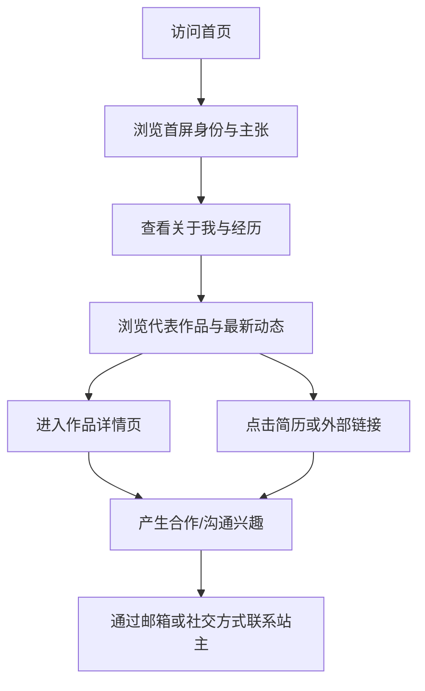

## 1. 产品概述
这是一个以“学术编辑风 + 现代作品集”融合为核心气质的个人主页，用于展示个人身份、经历、代表作品、时间线动态与联系方式。
- 目标是做出一个类似学者/研究者主页的可信表达界面，但在排版、动效与信息组织上更高级、更鲜明、更适合长期维护。
- 产品价值在于帮助访问者快速建立对站主的专业认知，并为求职、合作、演讲邀约、媒体曝光和社交转化提供统一入口。

## 2. 核心功能

### 2.1 功能模块
1. **首页**：首屏身份介绍、个人宣言、导航、头像/主视觉、核心链接入口。
2. **作品详情页**：展示单个项目、论文、文章或案例的背景、贡献、成果图像与外部链接。

### 2.2 页面详情
| 页面名称 | 模块名称 | 功能描述 |
|-----------|-------------|---------------------|
| 首页 | 顶部导航 | 固定导航，支持锚点跳转到关于、经历、作品、动态、联系等区块。 |
| 首页 | 首屏 Hero | 展示姓名、身份标签、一段高辨识度的个人陈述、核心按钮与头像/视觉插图。 |
| 首页 | 快速链接 | 提供简历、邮箱、GitHub、X/即刻、Google Scholar、LinkedIn 等可配置链接。 |
| 首页 | 关于我 | 用 2 至 4 段简短文字介绍个人方向、研究/职业兴趣、擅长领域与长期目标。 |
| 首页 | 精选经历 | 以纵向时间线或分栏形式展示教育、工作、实习、合作经历。 |
| 首页 | 代表作品 | 以卡片列表展示项目、论文、文章或产品案例，突出标题、摘要、标签、年份与外链。 |
| 首页 | 最新动态 | 采用新闻流形式展示近期更新，如获奖、演讲、发布、入职、上线等。 |
| 首页 | 能力与主题 | 展示关键词矩阵，例如“生成式 AI”“前端工程”“交互设计”“研究写作”。 |
| 首页 | 联系方式 | 展示邮箱、社交账号、城市、可合作方向与 CTA。 |
| 首页 | 页脚 | 显示版权、站点说明、更新时间与一句风格化收尾文案。 |
| 作品详情页 | 项目头图 | 展示项目标题、副标题、时间、角色、外链与返回入口。 |
| 作品详情页 | 内容正文 | 支持展示背景、问题、方案、过程、成果、媒体资源与相关链接。 |
| 作品详情页 | 相邻项目跳转 | 支持浏览上一项/下一项内容，增强站内阅读连续性。 |

## 3. 核心流程
访问者进入首页后，首先通过首屏区域建立对站主身份与方向的快速认知；随后根据目的浏览经历、作品与最新动态；当对某项成果感兴趣时，进入详情页继续阅读，并通过联系方式或外部平台完成转化。

## 4. 用户界面设计
### 4.1 设计风格
- **整体方向**：克制、精英感、编辑部式排版，避免模板化作品集外观。
- **视觉气质**：参考学术主页的可信感，但加入更现代的分栏结构、精细留白和轻量动效。
- **主色**：暖白纸张色、深墨黑、低饱和青灰作为辅助色。
- **强调色**：铜金或冷银二选一，用于链接 hover、分隔线、按钮描边与时间线节点。
- **按钮样式**：细描边矩形按钮 + 高对比文字按钮，悬停时出现轻微位移和底纹动画。
- **字体建议**：标题使用高辨识度衬线字体，正文使用可读性强的人文字体；中英文混排时保持风格统一。
- **布局样式**：桌面端以非对称双栏/三栏为主，移动端收敛为单栏纵向叙事。
- **图标风格**：线性、细线、克制，不使用卡通风图标。
- **背景细节**：加入极轻的纸张噪点、分隔线、章节编号、大号背景文字或几何纹理，增强出版物气质。
- **动效风格**：以渐入、位移、遮罩展开、时间线滚动激活为主，不做浮夸粒子特效。

### 4.2 页面设计概览
| 页面名称 | 模块名称 | UI 元素 |
|-----------|-------------|-------------|
| 首页 | 顶部导航 | 半透明固定顶栏、细线分隔、章节锚点、高亮当前分区。 |
| 首页 | 首屏 Hero | 大字号姓名、职业身份、小型个人宣言、头像/抽象视觉块、主次 CTA。 |
| 首页 | 关于我 | 两栏文案排版、章节编号、关键词高亮、精细分隔线。 |
| 首页 | 精选经历 | 竖向时间线、年份标签、机构名称、角色说明、节点 hover 高亮。 |
| 首页 | 代表作品 | 响应式卡片网格、封面图、关键词标签、摘要、外链按钮、详情入口。 |
| 首页 | 最新动态 | 类似新闻公告的列表排版，突出日期与事件。 |
| 首页 | 能力与主题 | 关键词矩阵、轻交互动效、不同权重字号体现关注重点。 |
| 首页 | 联系方式 | 大号邮箱链接、社交入口列表、合作邀请文案、底部 CTA。 |
| 作品详情页 | 项目头图 | 标题、副标题、元信息、主视觉、外链按钮、返回导航。 |
| 作品详情页 | 内容正文 | 富文本内容、图文混排、引用块、指标卡片、媒体展示。 |

### 4.3 响应式
- 采用桌面优先设计，宽屏下重点突出分栏排版、层级留白和大字号首屏。
- 平板端保留章节结构，适度压缩间距与字体等级。
- 移动端切换为单栏流式布局，保留锚点导航、核心 CTA 与主要内容块。
- 交互上兼顾鼠标 hover 与触屏点击反馈，确保按钮、链接和卡片均具备明确可点击区域。

### 4.4 内容配置原则
- 所有文本内容、链接、经历、作品、动态、联系方式均通过本地数据配置，方便后续维护。
- 支持后续扩展为“研究版”“求职版”“创业版”等不同内容版本，仅需替换配置数据。
- 在初版中使用高质量占位内容结构，便于后续由站主快速替换为真实资料。
