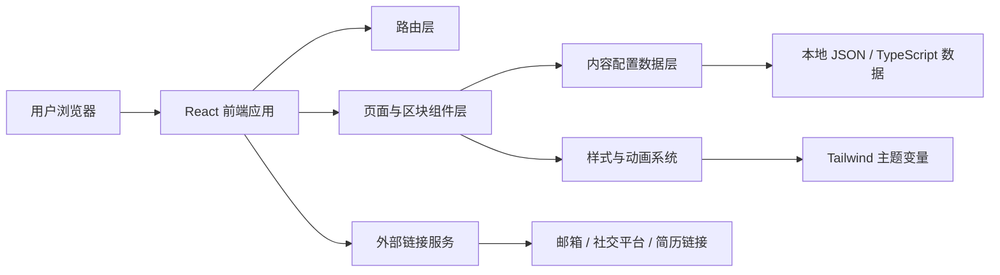
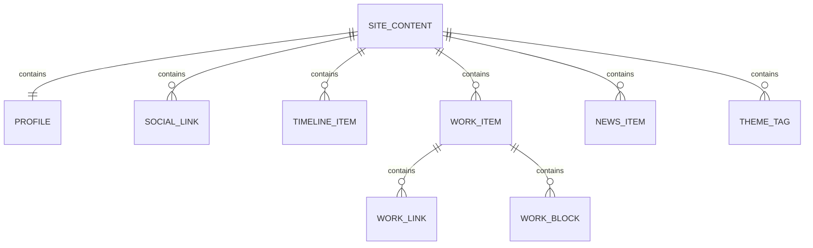

## 1. 架构设计
本项目采用纯前端架构，以 React 单页应用承载首页与作品详情页，内容数据本地化管理，不依赖后端服务即可完成上线。



## 2. 技术描述
- 前端：React@18 + TypeScript + Vite
- 样式：Tailwind CSS@3 + CSS 变量
- 路由：react-router-dom
- 动效：Framer Motion
- 图标：lucide-react
- 数据：本地 TypeScript 配置文件
- 后端：无
- 数据库：无
- 部署：Vercel 或 Netlify 等静态托管平台

## 3. 路由定义
| 路由 | 用途 |
|-------|---------|
| / | 个人主页首页，包含首屏、关于、经历、作品、动态、联系等内容 |
| /work/:slug | 作品、项目、论文或案例详情页 |

## 4. API 定义
本项目初版不设置后端 API，所有页面数据来自本地内容配置。

### 4.1 内容数据类型
```ts
type SocialLink = {
  label: string
  href: string
  type: 'primary' | 'secondary'
}

type TimelineItem = {
  year: string
  title: string
  organization: string
  description: string
}

type WorkItem = {
  slug: string
  title: string
  subtitle: string
  year: string
  tags: string[]
  summary: string
  coverImage: string
  links: Array<{ label: string; href: string }>
  content: Array<{
    type: 'paragraph' | 'quote' | 'metric' | 'image'
    value: string
    label?: string
  }>
}

type NewsItem = {
  date: string
  content: string
}

type SiteContent = {
  profile: {
    name: string
    title: string
    statement: string
    location: string
    email: string
  }
  socialLinks: SocialLink[]
  about: string[]
  timeline: TimelineItem[]
  works: WorkItem[]
  news: NewsItem[]
  themes: string[]
}
```

## 5. 模块划分
| 模块名称 | 职责 |
|----------|------|
| App Router | 管理首页与详情页路由切换 |
| Layout | 提供整体容器、背景、页脚、滚动体验与页面过渡 |
| Header | 渲染导航、锚点跳转与主要外链入口 |
| Hero Section | 呈现姓名、身份、宣言、头像/视觉元素与 CTA |
| About Section | 展示个人介绍与价值主张 |
| Timeline Section | 渲染教育/工作/经历时间线 |
| Works Section | 渲染代表作品卡片列表 |
| News Section | 渲染近期动态与公告流 |
| Contact Section | 渲染联系信息与合作入口 |
| Work Detail Page | 渲染单项作品详细内容 |
| Content Config | 统一维护站点文案、链接、图片与列表数据 |

## 6. 数据模型
### 6.1 数据模型定义


### 6.2 数据定义策略
- 使用 `src/content/siteContent.ts` 作为统一内容源，避免散落在组件中的硬编码文本。
- 图片资源优先本地化管理；若需生成演示视觉图，使用统一可替换的静态资源路径。
- 组件仅负责展示，不直接持有业务文本，便于后续内容替换与国际化扩展。

## 7. 样式与设计系统
- 使用 Tailwind CSS 结合 CSS 变量管理颜色、字号、间距、边框与阴影。
- 通过 `theme.css` 或全局样式文件定义品牌色、纸张底色、强调色、噪点层与排版尺度。
- 标题与正文采用不同字体体系，突出“编辑感”和“个人品牌感”。
- 重点实现桌面端的高品质排版，同时保证移动端简洁可读。

## 8. 动效策略
- 页面加载时使用分层渐入与轻微上移动画，强化首屏记忆点。
- 时间线、作品卡片与新闻列表支持滚动触发显现。
- 链接与按钮在 hover 时加入底纹扩展、描边位移或颜色转场。
- 所有动画以轻量、克制、丝滑为原则，避免影响阅读效率。

## 9. 可维护性与扩展性
- 通过内容配置与组件解耦，后续可快速替换为真实简历、论文、项目或博客内容。
- 可在不改动整体结构的情况下新增“文章页”“演讲页”“相册页”等扩展模块。
- 若未来需要接入 CMS 或后端接口，可保留当前数据类型并平滑迁移数据来源。
